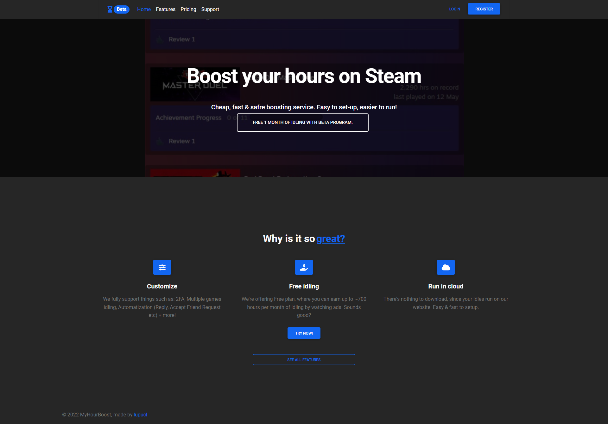
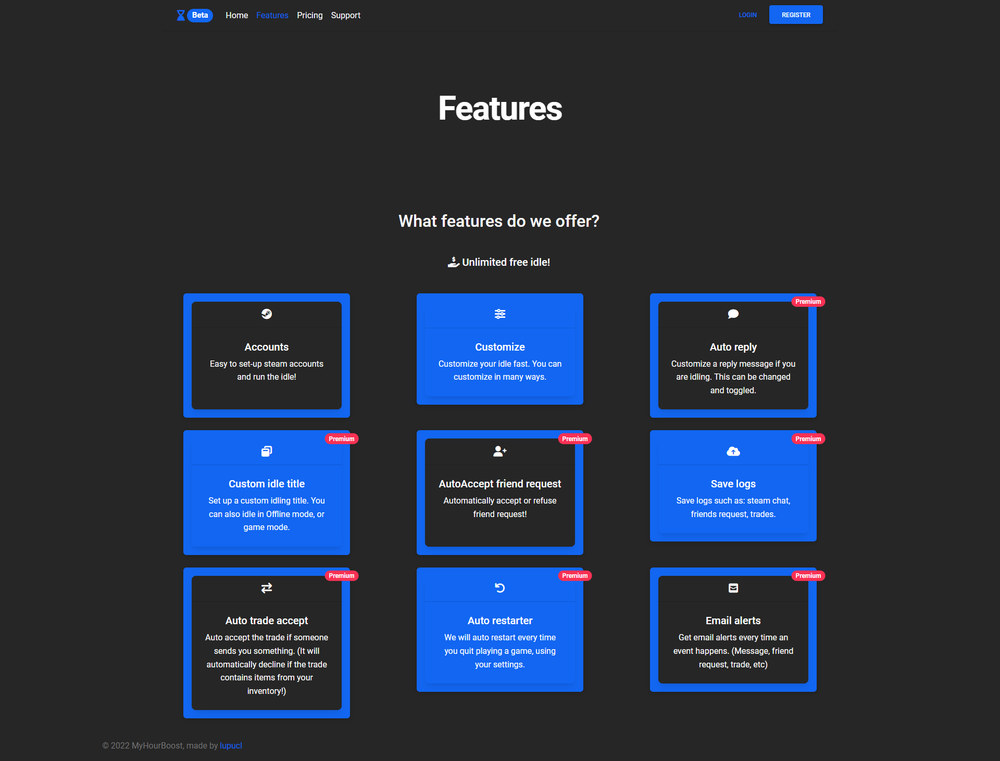
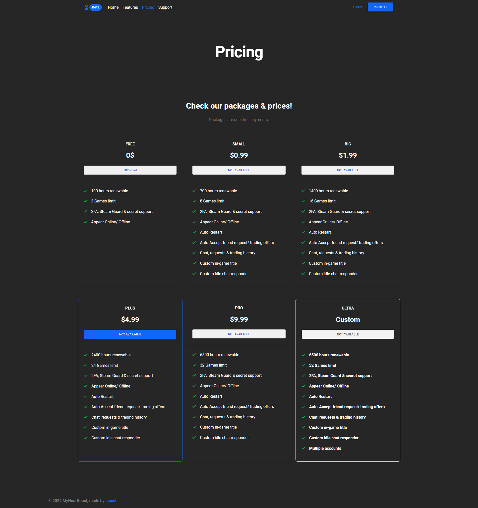
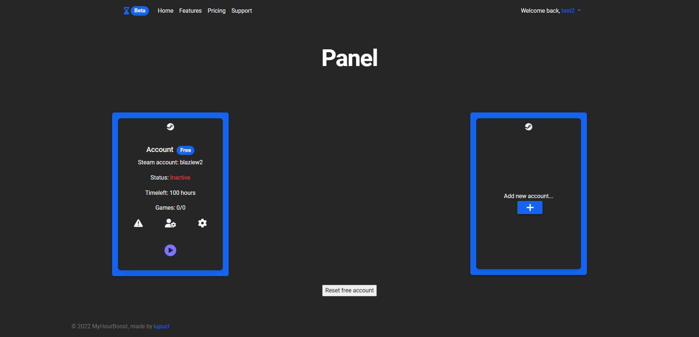
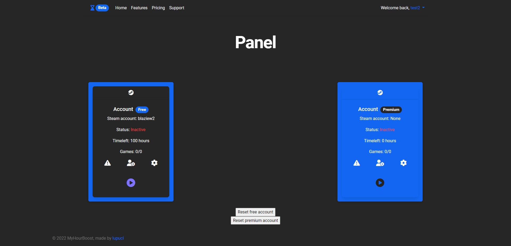
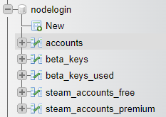

# MyHourBoost

MyHourBoost is an application to boost your hours on steam library.

I was planning to run it as a paid service, but now I want to give it for free to anyone who wants to use.
(Please don't remove the footer where is my name)

This was made using:
1. NodeJS
2. EJS
3. ExpressJS
4. HTML + CSS
5. Xampp (For MySQL database)

To connect to steam api, I used [steam-user](https://github.com/DoctorMcKay/node-steam-user) by [@DoctorMcKay](https://github.com/DoctorMcKay).

## How to use?
Download or clone the repository

Run npm install

Run npm start to start the server

For database, I used mysql with following tables:

1. accounts - for website accounts
2. steam_accounts_free - for steam accounts but for free plan
3. steam_accounts_premium - for steam accounts but for premium plan (multiple accounts)
4. beta_keys - beta keys to register
5. beta_keys_used - beta keys used by users


To create accounts db, use this SQL command:
```
CREATE TABLE IF NOT EXISTS accounts (
    id INT(6) UNSIGNED AUTO_INCREMENT PRIMARY KEY,
    username VARCHAR(30) NOT NULL,
    password VARCHAR(100) NOT NULL,
    email VARCHAR(50) NOT NULL,
	plan VARCHAR(30) DEFAULT 'free',
	beta_key VARCHAR(30) NOT NULL,
    reg_date TIMESTAMP DEFAULT CURRENT_TIMESTAMP ON UPDATE CURRENT_TIMESTAMP
)
```

To create steam accounts db, use this SQL command:
(Edit steam_accounts_free with steam_accounts_premium to add the 2nd account for premium accounts)
```
CREATE TABLE IF NOT EXISTS steam_accounts_free (
    id INT(6) UNSIGNED AUTO_INCREMENT PRIMARY KEY,
    username VARCHAR(30) NOT NULL,
    steam_username VARCHAR(30) NOT NULL,
    steam_password VARCHAR(100) NOT NULL,
    time_left INT(100) DEFAULT '100',
    plan VARCHAR(30) DEFAULT 'free',
    status VARCHAR(30) DEFAULT 'inactive'
)
```

To create beta keys database, use this SQL command:
```
CREATE TABLE IF NOT EXISTS beta_keys (
    id INT(6) UNSIGNED AUTO_INCREMENT PRIMARY KEY,
    betakey VARCHAR(30) NOT NULL,
    generated_on TIMESTAMP DEFAULT CURRENT_TIMESTAMP ON UPDATE 
)

CREATE TABLE IF NOT EXISTS beta_keys_used (
    id INT(6) UNSIGNED AUTO_INCREMENT PRIMARY KEY,
    betakey VARCHAR(30) NOT NULL,
    used_by VARCHAR(30) NOT NULL,
    used_on VARCHAR(30) NOT NULL
)
```


When you register to website, the password will be encrypted, and also the steam accounts will be encrypted too.

Website account encryptions was made using [bcrypt](https://www.npmjs.com/package/bcrypt) for hashing password (1 way encrypt) and steam account encryptions was made using [crypto](https://nodejs.org/api/crypto.html), using aes-256-cbc algorithm.
To customize this encryption, change:
```
const algorithm = "aes-256-cbc";
const initVectorString = "1234567890zxcvbn";
const SecuritykeyString = "1234567890zxcvbn1234567890zxcvbn";
```
in routers/index.js file.

aes256 algorithm uses:

Vector string - 16 bytes (16 chars)

Security string - 32 bytes (32 chars)

You can change the algorithm type. More informations [here](https://nodejs.org/en/knowledge/cryptography/how-to-use-crypto-module/)

This encryption is 2 ways, meaning, you can also decrypt the encryption.
The functions that I made, are 
- encrypt(text)
- decrypt(text)

(in index.js)

# How does it work?
1. Create account. Based on type, you'll be able to add account(s) (free > 1; premium > 2)
2. Add steam account; steam account(s) will be added to database, and the password will be encrypted using encrypt function.
3. Customize settings (soon)
4. Start the idler; it's decrypting the password in order to connect to steam, and store the running account to a list.
5. Stop the idler; automatically get's the name of your steam account, and search in the running accounts list. If it's found, it will stop the idling, if it's not found, then nothing will be stopped (since the account is not running)


### Note
In order to see the app page, you need a free or premium plan to account.

Free plan > access to 1 steam account

Premium plan > access to 2 steam accounts

Admin plan > Acces to a admin panel, where you can see users, and generate beta keys. For now, the beta keys will be displayed only on console, and to database!

# Updates/ to do
- [ ] Add support page 
- [ ] Optimize the code (make it lightweight)
- [ ] Add google login support
- [X] Re-add auto plan on register (free)
- [ ] Create a complex control panel for admins
- [ ] Add settings page to users (change pw, emails etc)
- [ ] Add steam settings - Title, Auto responder etc
- [ ] Remove beta key register
- [ ] Add email confirmation

Free accounts will be limited to 100 hours to idle, renewable every time when expires.
# Roadmap
```
app.js (main app function)
    |
    |- Routers
         |- index.ejs (pages render & functions - post/ get)
    |
    |- Views
         |- .ejs (html pages)
    |
    |- Public
         |- Images, Css, Js & Assets

```

# Showcase
You can find a video [here](https://www.youtube.com/watch?v=sDBT-DZDIy4)


Main Page


Features page


Pricing Page


Free user Page


Premium user Page


Database



If you have any question, don't hesitate to contact me at [lupucl.com](https://lupucl.com) or via email here: contact@lupucl.com
